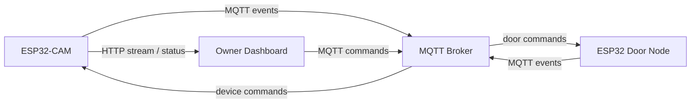

# Architecture

## Goal

Build one digital doorman system with:

- live door video from the ESP32-CAM
- face detection state
- ultrasonic proximity sensing
- manual authorize / deny actions from one owner-facing dashboard

## Node Responsibilities

### ESP32-CAM

- serve MJPEG video stream
- expose camera status
- run face detection / recognition control
- publish face and camera events over MQTT
- receive owner commands that affect the camera workflow

### ESP32 Door Node

- read ultrasonic distance
- determine presence near the door
- drive relay / lock / buzzer logic
- publish proximity and door state over MQTT
- receive authorize / deny commands

### Frontend Dashboard

- display the live stream from the ESP32-CAM
- show presence, face-detection, and door status
- let the owner enable/disable face recognition
- let the owner authorize or deny entry
- subscribe and publish through MQTT over WebSockets

## System View

## Suggested Integration Sequence

1. Keep the camera sketch as the base for video.
2. Define MQTT topics before wiring the dashboard.
3. Finalize the door node behavior for proximity + relay.
4. Connect the dashboard to:
   - `http://ESP32_CAM_IP:81/stream`
   - `ws://MQTT_BROKER:PORT`
